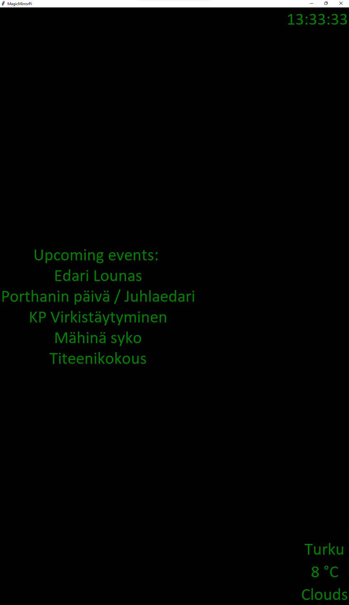

# MagicMirrorPi

## Simple Magic Mirror software that includes google calendar, time and weather updates. 

Application in portrait mode

### Packages required:
- google-auth-oauthlib
- httplib2
- google-api-pyhton-client
- oauth2client

## How to use?

To use the application, you need to add google calendar API credentials to "credentials.json" file. From google developer site, find credentials and add an "OAuth 2.0 Client ID" and copy the file content to credentials.json. The application will ask you to login when run for the first time. After this, it should log in automatically.

## How does it work?

### Calendar
The application parses first 5 events from your calendars it has access to. After this it parses the event names into more readable form, and displays them on the screen.

### Weather
Weatherdata is fetched from Openweathermap. Currently it is configured to show weather in Turku, using Celsius. These can be changed from the code in the "getWeather" method.

